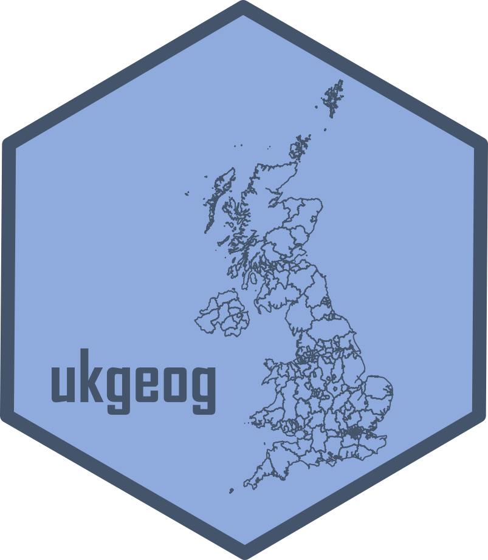

<!-- README.md is generated from README.Rmd. Please edit that file -->

# ukgeog <a href='https://l-hodge.github.io/ukgeog/'>

<!-- badges: start -->

[](https://travis-ci.org/l-hodge/ukgeog)
[](https://codecov.io/gh/l-hodge/ukgeog?branch=master)
[](https://github.com/l-hodge/ukgeog/actions)
[](https://www.tidyverse.org/lifecycle/#experimental)
<!-- badges: end -->

## Overview

`ukgeog` is a simple package to facilitate the easy download of official
spatial data sets of the UK. It includes a wide range of geospatial
data, provided as [simple feature `sf`
objects](https://r-spatial.github.io/sf/articles/sf1.html) (like
shapefiles but better). Making it easy to make [Choropleth
Maps](https://en.wikipedia.org/wiki/Choropleth_map) with `base R`, as
well as with popular packages such as
[`ggplot2`](https://ggplot2.tidyverse.org/) and
[`leaflet`](https://rstudio.github.io/leaflet/).

## Installation

``` r
# install.packages("remotes")
remotes::install_github("l-hodge/ukgeog")
```

## Basic Usage

``` r
library(ukgeog)

# Read in simple feature data frame of the countries that make up the UK 
sf <- read_admin("NAT")
```

## Available datasets

### Read in sf

The `read_sf` function can be used to download boundaries for the
following geographies using the ‘geog’ argument:

| ‘geog’ | Geography                                     | Year                   |
|:-------|:----------------------------------------------|:-----------------------|
| UTLA   | Counties_and_Unitary_Authorities              | 2018; 2019; 2020; 2021 |
| NAT    | Countries                                     | 2018; 2019; 2020; 2021 |
| EU     | European_Electoral_Regions                    | 2018                   |
| LAD    | Local_Authority_Districts                     | 2018; 2019; 2020; 2021 |
| LSOA   | Lower_Super_Output_Areas                      | 2001; 2011             |
| MSOA   | Middle_Super_Output_Areas                     | 2001; 2011             |
| WAC    | National_Assembly_for_Wales_Constituencies    | 2018                   |
| WAR    | National_Assembly_for_Wales_Electoral_Regions | 2018                   |
| NUTS1  | NUTS_Level_1                                  | 2015; 2018             |
| NUTS2  | NUTS_Level_2                                  | 2015; 2018             |
| NUTS3  | NUTS_Level_3                                  | 2015; 2018             |
| OA     | Output_Area                                   | 2001; 2011             |
| GOR    | Regions                                       | 2018; 2019; 2020; 2021 |
| WM     | Westminster_Parliamentary_Constituencies      | 2018; 2019; 2020; 2021 |

### Other functions

| Function           | Description                                          | Years available |
|--------------------|------------------------------------------------------|-----------------|
| `convert_lnglat`   | Convert Eastings/Northings to Latitude/Longitude     | \-              |
| `across_yr_lookup` | Create geographical lookup across years              | 2011-2021       |
| `within_yr_lookup` | Create a within year lookup between LAD’s and UTLA’s | 2011-2021       |

## Vignettes

-   [Creating Choropleth Maps with
    `ukgeog`](https://l-hodge.github.io/ukgeog/articles/maps.html)
-   [Local Authority Boundary
    Changes](https://l-hodge.github.io/ukgeog/articles/boundary-changes.html)
-   [ONS Hierarchy of UK Statistical
    Geographies](https://l-hodge.github.io/ukgeog/articles/ons-hierarchy.html)

## Credits

Original shapefiles are created by the Office for National Statistics
(ONS) and are available from the [Open Geography
Portal](http://geoportal.statistics.gov.uk/)
